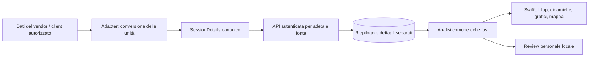

# Dettagli della seduta attraverso i layer

Il backend multi-atleta e il client iOS ora condividono un contratto per lap, campioni, dinamiche, zone FC e segmenti GPS. I dettagli sono archiviati separatamente dal riepilogo dell'attività: le letture dello storico e il motore delle proposte non caricano l'intera telemetria di ogni allenamento.

## Contratto e unità

`app/integrations/session_details.py` definisce la boundary. Lunghezze e distanze sono in metri, tempi in secondi, velocità in m/s, FC in bpm, potenza in watt. Cadenza completa in passi/min e cadenza della pedalata in rpm sono campi distinti. Contatto a terra e oscillazione verticale vengono convertiti in ms e cm soltanto nella rappresentazione della review. Nessun valore ideale di cadenza o stride length è imposto.

Lap e campioni sono ordinati, con tempi coerenti, valori finiti, limiti di quantità e copertura dichiarata. La distanza può essere sconosciuta: HR e durata rimangono utilizzabili, mentre il passo da tempo/distanza resta assente. La geometria contiene segmenti distinti; buchi GPS espliciti non vengono colmati unendo gli estremi. Il contratto ammette al massimo 500 lap, 4.000 campioni e 2.000 punti GPS complessivi.

Gli indici di step identificano le foglie eseguibili del template, da zero, contando una volta i figli di un repeat. Non sono indici dei marcatori repeat FIT. Richiedono un riferimento esplicito a versione del piano e workout. Senza tale riferimento le fasi restano descrittive: il nome della seduta o la posizione di un lap non dimostrano il completamento di una ripetuta.

## API e concorrenza

| API | Comportamento |
| --- | --- |
| `GET /v1/activities/{provider}/{provider_id}/details` | Stato, versione e hash del riepilogo della propria fonte; dati e analisi se disponibili |
| `PUT /v1/activities/{provider}/{provider_id}/details` | `expected_details_version`, `expected_activity_hash`, `details`; controllo di proprietario e conflitti, senza chiamate vendor |
| `GET /v1/review/workout` | Include `detailed_review` per l'ultima attività, con stato ready/not_loaded/stale/unsupported |
| `GET /v1/me/export` | Include i dettagli originali delle proprie fonti |

La scrittura serializza le modifiche sull'atleta e verifica versione dei dettagli e hash del riepilogo. Campioni oltre la durata/distanza della fonte e riferimenti a un piano incoerente vengono rifiutati. La modifica del riepilogo rende obsoleti i dettagli precedenti; il contenuto rimane esportabile ma non viene analizzato finché non è aggiornato.

La tabella `ac_activity_details` ha una chiave composta atleta/fonte/ID attività e una foreign key verso la medesima fonte. Eliminare la fonte o l'account elimina anche i relativi dettagli. Se un evento ha più fonti, la review può usare una fonte con dettagli validi, indicandola esplicitamente; non fonde lap o GPS di fonti differenti.

Il confronto dei target usa la versione storica esplicitamente riferita. Aggiornare il piano corrente non riscrive i target dell'allenamento passato. Il collegamento è fornito dal client e non viene pubblicizzato come verifica del workout originale sul vendor. I dettagli importati richiedono ancora accesso autorizzato alla fonte.

## Analisi e adapter

`evaluate_measured_session` in `app/services/session_analysis.py` è il calcolo condiviso, senza rete o storage. La lettura Garmin personale conserva il suo parser e chiama lo stesso calcolo. L'ordine delle fasi, oltre alla loro presenza, viene confrontato con gli step riferiti; gli autolap consecutivi del defaticamento restano nella medesima fase.

`app/garmin/session_details.py` converte un payload Garmin già disponibile alla boundary canonica, correggendo cm→m, ms→s, cadenza e indici FIT. Questo adapter non apre sessioni né chiama Garmin. Il servizio piattaforma accetta il formato canonico senza importare il modulo Garmin personale nel container. Non è un'integrazione cloud Garmin/COROS/Suunto approvata e non abilita da solo l'API del produttore.

## Client iOS

La review nativa mostra giudizi tecnici, target della versione riferita, fasi, lap, stride length, cadenza, contatto a terra e potenza, quando disponibili. Passo e FC hanno grafici separati con unità esplicite. I tratti con dati assenti non vengono uniti; la mappa conserva la separazione dei segmenti GPS. Le sedute manuali mantengono il loro percorso di feedback dichiarato.

Il client corrente HealthKit importa ancora i riepiloghi. Questa estensione permette di visualizzare dettagli quando un client/adapter autorizzato li carica nel nuovo contratto; non dimostra che ogni watch o app HealthKit fornisca lap, dinamiche o GPS. Il collegamento AI remoto, HealthKit su dispositivo reale e gli accessi vendor approvati restano da verificare.

## Migrazione e verifiche

Il database piattaforma usa la revisione **3**. L'operazione esplicita `python -m app.platform.cli init-db` aggiorna revisioni 1 o 2 aggiungendo le tabelle mancanti previste, senza riscrivere account, piani, profili o attività. L'avvio API non migra e rifiuta revisioni sconosciute o schemi incompleti. Prima di un aggiornamento su un deployment esistente conserva un backup appropriato.

Le verifiche coprono parità dei target fra formato Garmin e canonico, unità delle dinamiche, campioni/zone incompleti, separazione GPS, defaticamento, controlli di proprietario, conflitti di versione, invalidazione dei dettagli, riferimenti storici, export/cascate e migrazione 2→3 con profilo e attività esistenti. La fixture nativa è catturata dall'API autenticata con dati sintetici; il test Swift verifica il percorso API→modelli nativi. Il simulatore non sostituisce una verifica su dispositivo reale o una release firmata.
