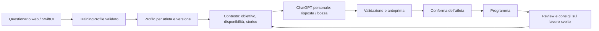

# Il coach parte dal profilo dell'atleta

La prima visita alla versione personale locale apre `/onboarding`. Il primo accesso autenticato all'app iOS richiede lo stesso questionario prima delle schede operative. Le risposte definiscono il contesto del coach: non creano automaticamente un allenamento, non sovrascrivono un programma e non collegano un account del produttore.

## Questionario in cinque passaggi

1. Sport, obiettivo concreto e scadenza, con possibilità di concordare una data flessibile.
2. Età, peso e altezza facoltativi, dispositivo e modello, sensore FC e misuratore di potenza. L'interfaccia attuale è per adulti.
3. Esperienza come corridore/ciclista, chilometri settimanali recenti, continuità e interruzioni, migliori prestazioni dichiarate con distanza e tempo totale.
4. Giorni disponibili, minuti massimi per giorno, palestra/forza e vincoli facoltativi. Il tempo comprende tutte le sedute.
5. Riepilogo e conferma dell'uso delle risposte per il coaching.

Un atleta senza dispositivo può completare l'intero percorso. Il coach usa obiettivi, esperienza e feedback testuali; non inventa FC, split, GPS o dinamiche. Selezionare Garmin/COROS/etc. registra una preferenza, non dimostra una connessione API. I migliori tempi restano dichiarazioni dell'atleta e non diventano soglie fisiologiche.

## Centro del prodotto: l'assistente

Dopo il questionario la home locale è `/coach`, con obiettivo, scadenza, settimana disponibile, collegamento ChatGPT e conversazione. Il precedente pannello operativo è `/dashboard`; Review e Consigli restano accessibili. Il profilo è modificabile da Profilo e obiettivi.

Ogni invio al coach è esplicito e include questionario, programma corrente se presente, riepiloghi delle attività recenti e una conversazione limitata. Il percorso GPS e le credenziali non sono inclusi. La cronologia locale mantiene al massimo sei scambi ed è separata per account ChatGPT; un cambio di questionario la invalida. La risposta è accettata soltanto dopo la conclusione dello stream ufficiale e un nuovo controllo di account e contesto.

Senza un programma esistente, l'atleta può richiedere una bozza iniziale di 14 giorni. Il modello può restituire domande di chiarimento invece di una bozza. Il software valida il formato Plan, l'orizzonte futuro, lo sport, i giorni e i minuti disponibili, la palestra e la struttura semplice a tempo. Non assegna target numerici non verificati. Una bozza viene salvata soltanto dopo conferma; scade dopo 15 minuti e si invalida se cambiano profilo, account o contesto. Nessun invio all'orologio è automatico. Per un programma esistente, le proposte di adattamento continuano a usare la review e il trend comparabile.

L'architettura separa questi compiti:

Il collegamento ChatGPT e la conversazione sono implementati nella versione personale locale. Nel client iOS la home Coach mostra obiettivo e disponibilità; il collegamento AI remoto non è ancora abilitato. La distribuzione remota/commerciale resta soggetta all'accesso OpenAI previsto per [Sign in with ChatGPT](https://developers.openai.com/siwc/quickstart). La prima inferenza con un vero account dell'atleta richiede il suo accesso e consenso; i test sintetici non la sostituiscono.

## Contratti e archiviazione

`app/training_profile.py` è il contratto comune. Le API locali sono `GET/PUT /api/profile`, `GET /api/assistant`, `POST /api/assistant/message` e `POST /api/assistant/plan/apply`. `ProfileWrite` richiede `expected_version`; un salvataggio concorrente restituisce 409. Gli errori di validazione non ripetono le risposte private nel payload di errore.

Il backend autenticato espone `GET/PUT /v1/profile`. Il profilo appartiene all'identità autenticata: il body non può scegliere un atleta. Viene salvato separatamente dal piano e dalle attività, compare nell'export dell'account e viene eliminato con l'account. L'audit registra la versione, non le risposte.

Il database piattaforma usa ora la revisione 2. Prima di aggiornare un database esistente, conserva un backup appropriato e avvia esplicitamente `python -m app.platform.cli init-db`: la migrazione 1→2 aggiunge `ac_athlete_profiles` senza cancellare account, piani o attività. Il server non migra durante l'avvio e rifiuta revisioni sconosciute o schemi incompleti. La migrazione è coperta da test SQLite/PostgreSQL in CI.

## Evidenze e limiti

Le verifiche includono primo ingresso senza piano/dispositivo, salvataggio e conflitti di versione, mancata modifica del piano, isolamento tra account, export/cancellazione, migrazione con dati esistenti, memoria AI limitata e separata, conferma della bozza, invalidazione del contesto e rifiuto delle bozze fuori disponibilità. Le fixture Swift/HTTP sono sintetiche.

Il browser è stato verificato con un server di test separato e risposte sintetiche, senza inviare dati a OpenAI. I dati reali del computer non sono stati trasformati in risposte al questionario. Build e test nativi vengono eseguiti in macOS CI; firma, dispositivo reale, hosting, account vendor e App Store restano da completare.
