# Prime sedute dal questionario

Il tab Coach può chiedere a ChatGPT una bozza iniziale di 14 giorni quando l'atleta non ha ancora un programma. Servono un collegamento ChatGPT idoneo, un modello disponibile e il consenso separato a condividere il contesto. Non si usano chiavi API. Il modello può rispondere con domande mirate e `plan:null` se le informazioni non bastano.

## Flusso e isolamento

```mermaid
flowchart LR
    Q[Profilo e storico dell'atleta] --> C[GET /v1/coach/context]
    C --> AI[ChatGPT sul dispositivo / stream completo]
    AI --> P[JSON explanation + plan oppure chiarimenti]
    P --> V[POST /v1/coach/initial-plan/preview]
    V --> UI[Anteprima: date, sport, durata, fasi e recupero]
    UI --> U[Conferma esplicita dell'atleta]
    U --> A[POST /v1/coach/initial-plan/apply]
    A --> L[Blocco DB dell'atleta / nuova verifica del contesto]
    L --> S[Prima versione immutabile del programma]
```

Il backend valida il JSON fornito dal client e **non esegue né attesta un'inferenza OpenAI**. La provenienza è una bozza fornita dal client, che nel percorso nativo viene dal flusso ChatGPT. Non riceve token OpenAI o la registrazione dell'account ChatGPT. La review e l'adattamento di programmi esistenti continuano a usare le loro proposte e verifiche separate.

## Controlli condivisi

`app/initial_plan.py` contiene la policy pura usata dalla versione personale e dalla piattaforma: massimo 28 sedute nei prossimi 14 giorni, almeno una seduta di allenamento, sport compatibile, sedute aerobiche semplici a tempo senza target numerici, ripetizioni o qualità non ancora stabilita. Durata dichiarata e somma delle fasi coincidono. Il totale per giorno include palestra e rispetta la disponibilità; la frequenza della forza rispetta ogni finestra di sette giorni. Non sono ammessi metadati dell'atleta nel piano generato. Limiti di testo e payload impediscono bozze eccessive. Il profilo deve avere una scadenza ancora valida.

Questi controlli verificano struttura, disponibilità e limiti iniziali. Non provano da soli che il carico scelto sia appropriato a ogni atleta: il modello deve motivare carico, recupero, ipotesi e chiarimenti, e la qualità del coaching richiede ancora una prova con atleti reali. Le risposte del questionario e i PB rimangono dati dichiarati.

## Contratti

La preview riceve `expected_context_hash`, `plan` e `explanation`. Restituisce il piano normalizzato, spiegazione, `context_hash`, `draft_hash`, `expires_at`, `inference_performed:false` e `vendor_sync:not_sent`. Non salva un piano o una bozza sul server.

L'app conserva l'anteprima solo in memoria, per 15 minuti, legata a identità EnduranceCoach, account ChatGPT e generazione della connessione. Chiuderla o cambiare account la invalida. Il modello non può scrivere il calendario direttamente.

L'apply riceve gli stessi dati con `draft_hash`, `expires_at` e `confirmed:true`. Dentro un'unica transazione il servizio blocca l'atleta, verifica che non esista già un piano, rilegge profilo e storico, ricalcola la policy e l'impronta, poi crea la versione 1. Due richieste concorrenti non possono sovrascriversi. Il fingerprint comprende anche l'identità autenticata; il body non può indicare un altro atleta. Gli audit conservano versione e motivo, senza risposte private o token.

L'anteprima è **stateless e fornita dal client**, non una proposta persistente firmata dal server. Il fingerprint rileva cambiamenti rispetto alla preview del normale flusso, ma non è un'attestazione crittografica della provenienza AI o della data di emissione. L'apply non si affida alla preview per autorizzare il piano: ricontrolla integralmente i dati correnti, la scadenza entro una finestra di 15 minuti e i diritti dell'atleta. Un client autenticato può già creare o modificare il proprio programma tramite la normale API; non ottiene diritti su altri utenti. La preview non è recuperabile dopo la chiusura dell'app.

Il database rimane alla revisione 3; non sono aggiunte tabelle o migrazioni. Il container include soltanto la nuova policy comune e il servizio piattaforma, mantenendo l'esclusione di Garmin personale, credenziali e dati locali.

## Verifiche e limiti

I test sintetici coprono conferma, assenza di scritture durante la preview, scadenza, modifiche a profilo/storico/bozza, owner binding, incompatibilità di sport, target non ammessi, durata/fasi, disponibilità con palestra, frequenza della forza e due worker concorrenti. I test Swift verificano formato della risposta, chiarimenti e guardie di account/scadenza. Nessun test usa un account OpenAI, un atleta reale o invia allenamenti agli orologi.

La generazione reale, il percorso UI completo della nuova anteprima su iPhone e la validazione professionale del carico restano da provare. Hosting, vendor ufficiali e App Store rimangono incompleti.

La verifica del codice `78b27ef` è passata: [241 test Python, 69 PostgreSQL e container](https://github.com/Tatonta/EnduranceCoach/actions/runs/37958250398), [build iOS, 37 test di contratto e due flussi UI esistenti](https://github.com/Tatonta/EnduranceCoach/actions/runs/37958250323). I flussi UI non provano una generazione reale né l’intera nuova anteprima; i limiti indicati sopra rimangono aperti.
