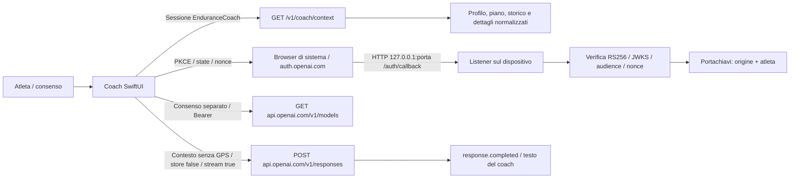

# Collegamento ChatGPT nativo: stato e confini

Il modello di distribuzione scelto è gratuito e open source. Il tab Coach implementa un percorso **sperimentale** di Sign in with ChatGPT e review diretta: nessuna chiave API, nessun token OpenAI consegnato al backend. La disponibilità dell'account e del piano viene stabilita da OpenAI. Una vera autorizzazione e una vera risposta su iPhone devono ancora essere provate.

## Comunicazioni

I token sono protetti dal Portachiavi con `WhenUnlockedThisDeviceOnly`; non vengono esportati con l'account, inseriti in UserDefaults, mandati al servizio EnduranceCoach o registrati nei log. La registrazione usa un host ID opaco stabile e conserva il client ID emesso prima dello scambio del codice, anche in caso di errore da ritentare. Firma, issuer, audience, scadenza, nonce e subject sono verificati prima di attivare le credenziali. I refresh sono serializzati e la rotazione salvata prima di riutilizzare il token.

Il catalogo legge `models[].slug`, `display_name` e `visibility`, nell'ordine restituito dal server. La richiesta usa solo il modello disponibile per l'account corrente. Una risposta parziale, fallita o interrotta non è accettata come review. Prima dell'invio e dopo la risposta vengono verificati account e impronta del contesto; dati cambiati richiedono una nuova richiesta. Il testo AI non modifica il piano: le proposte e la conferma continuano a passare dai controlli deterministici del servizio.

Il consenso all'invio è separato dal questionario e dal permesso di usare il piano ChatGPT. Include obiettivi, risposte testuali del profilo, piano, storico recente e metriche della seduta; esclude le coordinate GPS e le credenziali tramite il contesto comune. Le risposte restano in memoria, senza archivio conversazionale remoto dell'app o accesso alla memoria ChatGPT. La generazione nativa di un piano strutturato e la conversazione persistente non sono ancora implementate.

## Callback iOS e verifiche mancanti

La documentazione OpenAI richiede HTTP su `127.0.0.1` con `/auth/callback`; non viene sostituito con uno schema personalizzato o un callback HTTPS. Un listener Network.framework riceve il callback e annulla il browser dopo la validazione. L'impiego di `ASWebAuthenticationSession(callbackURLScheme: nil)` con questo listener è una scelta d'implementazione: **non è una compatibilità iOS/OpenAI già verificata**. Se il browser non consegna il callback, l'operazione scade o viene annullata e nessuna connessione viene dichiarata riuscita.

I test sintetici coprono PKCE, URI/state/client ID/expiry, JWT firmato e alterato, formato del catalogo, evento terminale e listener locale. Il flusso UI mostra il pulsante senza aprire OpenAI. Restano da provare login/consenso reali, cambio o revoca del piano, rotazione reale, interruzioni/background, Portachiavi su hardware e qualità della review con un atleta. Nessuna inferenza live viene eseguita dai test.

Scollega ChatGPT elimina localmente i token, tenta la revoca remota e conserva il client ID per un successivo login allo stesso account. Un errore remoto è comunicato senza riutilizzare i token. Uscire da EnduranceCoach elimina lo stato in memoria e interrompe l'accesso; la registrazione cifrata può essere ripristinata solo dall'atleta della stessa origine. Eliminare l'account rimuove anche la registrazione locale. La revoca remota non cancella il client registrato presso OpenAI.

## Fonti ufficiali

- [Registrazione, PKCE e verifica identità](https://developers.openai.com/siwc/token-sharing-open-source/sign-in)
- [Account, refresh, revoca e protezione token](https://developers.openai.com/siwc/token-sharing-open-source/profiles-and-sessions)
- [Catalogo e inferenza](https://developers.openai.com/siwc/token-sharing-open-source/models-and-inference)
- [Limiti del percorso in preview](https://developers.openai.com/siwc/token-sharing-open-source/preview-limitations)

La policy privacy/support e le dichiarazioni App Store devono descrivere l'invio diretto a OpenAI, eventuali limiti del piano, le scelte di conservazione e la rimozione. Non sono sostituite dal manifest di progetto. Hosting, firma Apple, accessi vendor e distribuzione App Store restano incompleti.
